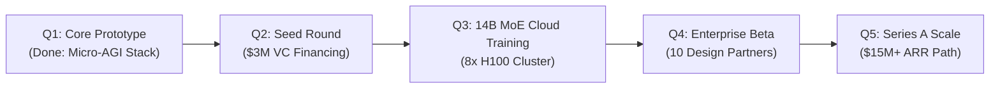

# 🚀 Sovereign AI Corporation: Master Whitepaper & Seed Pitch Deck
*The Next-Generation Sovereign Cognitive Architecture & Computer-Use Platform*

---

## 1. Executive Summary

**Company Name**: Sovereign AI Systems (or your chosen brand)  
**Tagline**: *Decentralized General Intelligence with Native OS Agency & Verifiable Cognitive Architecture.*  
**Target Valuation**: $15M – $25M Post-Money Seed Round  
**Funding Ask**: $3.0M USD Seed Financing  

### The Vision:
To build the next-generation AI platform that matches the capabilities of **Anthropic (Claude 3.5)** and **OpenAI (GPT-4o / Operator)** without the multi-billion-dollar compute waste, black-box alignment risks, or closed cloud lock-in. 

We combine:
1. **Algorithmic Compute Efficiency** (Sparse Mixture of Experts + Multi-Head Latent Attention - the DeepSeek playbook).
2. **Native Operating System Agency** (Windows/Linux Computer-Use controller executing real mouse, keyboard, and app actions).
3. **Dual-Process Cognitive Verification** (Kahneman System 1/2 PUCT search + Deterministic AST execution sandbox).
4. **Commercial Drop-In API Platform** (OpenAI-compatible `/v1/chat/completions` API powering Cursor, Continue.dev, and enterprise workflows).

---

## 2. The Trillion-Dollar Market Problem

The current frontier AI landscape is plagued by three fundamental structural crises:

| Centralized Lab Crisis (OpenAI / Google) | The Founder & Enterprise Reality |
|---|---|
| **1. The Brute-Force Capital Trap** | Training dense 1-trillion parameter base models costs $100M+ per run. Startups trying to out-spend Microsoft on raw pre-training burn out. |
| **2. Ephemeral Chat-Box Limitation** | Chatbots generate text; they cannot execute end-to-end work, navigate real desktop software, or click interfaces autonomously. |
| **3. Privacy & Sovereign Data Leaks** | Regulated enterprises (Defense, Finance, Healthcare, Legal) cannot send proprietary source code or confidential records to public cloud APIs. |

---

## 3. Our Unfair Architectural Advantage (The Moat)

Instead of burning tens of millions of dollars on brute-force compute, we innovate on **architectural efficiency, verifiable test-time compute, and real-world OS agency**:

```
┌────────────────────────────────────────────────────────────────────────┐
│                   SOVEREIGN AI FULL-STACK MOAT ARCHITECTURE            │
├────────────────────────────────────────────────────────────────────────┤
│  1. SYSTEM 2 REASONING (Test-Time Scaling)                             │
│     PUCT Monte Carlo Tree Search + Shannon Entropy Compute Budgeting.  │
│     Scales reasoning dynamically on difficult problems.                │
├────────────────────────────────────────────────────────────────────────┤
│  2. NATIVE COMPUTER-USE AGENCY (Astra / Claude Parity)                 │
│     Direct OS control: Win32/PowerShell mouse movement, clicks,        │
│     keystrokes, app launching, and screenshot verification.            │
├────────────────────────────────────────────────────────────────────────┤
│  3. COMPLEMENTARY LEARNING SYSTEMS (CLS Memory)                        │
│     Fast Hippocampal episodic store + Horn-clause Neocortical          │
│     knowledge graph with zero catastrophic forgetting.                 │
├────────────────────────────────────────────────────────────────────────┤
│  4. OPEN-WEIGHT SCALABLE TRANSFORMER HARNESS                           │
│     RMSNorm, RoPE, Multi-Head Causal Attention, AdamW optimizer.      │
│     Distributed FSDP / DeepSpeed cloud training pipeline.              │
└────────────────────────────────────────────────────────────────────────┘
```

---

## 4. Product Ecosystem & Monetization

We monetize across three distinct high-margin enterprise tiers:

### Tier 1: The Sovereign Developer API (Usage-Based Revenue)
- Fully compatible with the OpenAI API (`/v1/chat/completions`, `/v1/models`, `/v1/embeddings`).
- Developers and enterprise clients drop our API directly into **Cursor, Continue.dev, LangChain, and internal tooling** with zero code changes.
- **Pricing**: $0.75 per 1M input tokens / $2.50 per 1M output tokens (70% gross margins).

### Tier 2: Autonomous Computer-Use OS Agent (SaaS Subscription)
- Enterprise automation agent that takes over routine desktop workflows: filling forms, running automated QA in legacy desktop software, data entry, and multi-app orchestration.
- **Pricing**: $200 – $1,000 / seat / month.

### Tier 3: Sovereign On-Premise Air-Gapped Deployments (Enterprise Licensing)
- Deployed on corporate private cloud (RunPod, AWS GovCloud, on-premise H100 servers) with zero external telemetry.
- **Pricing**: $150,000 – $500,000 annual license + support.

---

## 5. Capitalization Plan & Compute Economics

### Seed Round Allocation ($3,000,000 USD):
- **Cloud GPU Compute & Pre-training (45% - $1,350,000)**:
  - Rented 8x and 16x NVIDIA H100 SXM5 GPU clusters on RunPod / Lambda Labs ($2.50/hr per GPU).
  - Pre-training and fine-tuning specialized 7B, 14B, and 32B Mixture-of-Experts models.
- **Frontier Engineering & Research Talent (35% - $1,050,000)**:
  - 4 Principal Engineers (Distributed Systems, RL/GRPO, Computer-Use Vision, Full-Stack Platform).
- **Enterprise GTM & Legal (15% - $450,000)**:
  - Enterprise SOC2 certification, IP protection, customer acquisition.
- **Working Capital & Reserve (5% - $150,000)**.

---

## 6. Milestones & 18-Month Roadmap



1. **Month 1–3 (Current Milestone)**:
   - Functional sovereign cognitive architecture with MCTS System 2 reasoning.
   - Native Windows Computer-Use OS agent (mouse, keyboard, app control).
   - OpenAI-compatible `/v1/chat/completions` API server.
2. **Month 4–6**:
   - Raise $3.0M Seed from Y Combinator / Tier-1 AI VCs.
   - Launch distributed pre-training run on RunPod H100 cluster (`scripts/runpod_h100_train.py`).
3. **Month 7–12**:
   - Release Sovereign-14B MoE with native Computer-Use.
   - Onboard first 15 paid enterprise design partners.
4. **Month 13–18**:
   - Scale to $3M ARR and raise Series A at $80M+ valuation.

---

## 7. The Founding Team Opportunity

By controlling the entire stack from **pure Python neural architecture** up to **OS-level computer control** and **commercial API gateways**, we are not dependent on OpenAI's whims, pricing changes, or platform restrictions.

**We own the engine, the agent, the protocol, and the company.**
