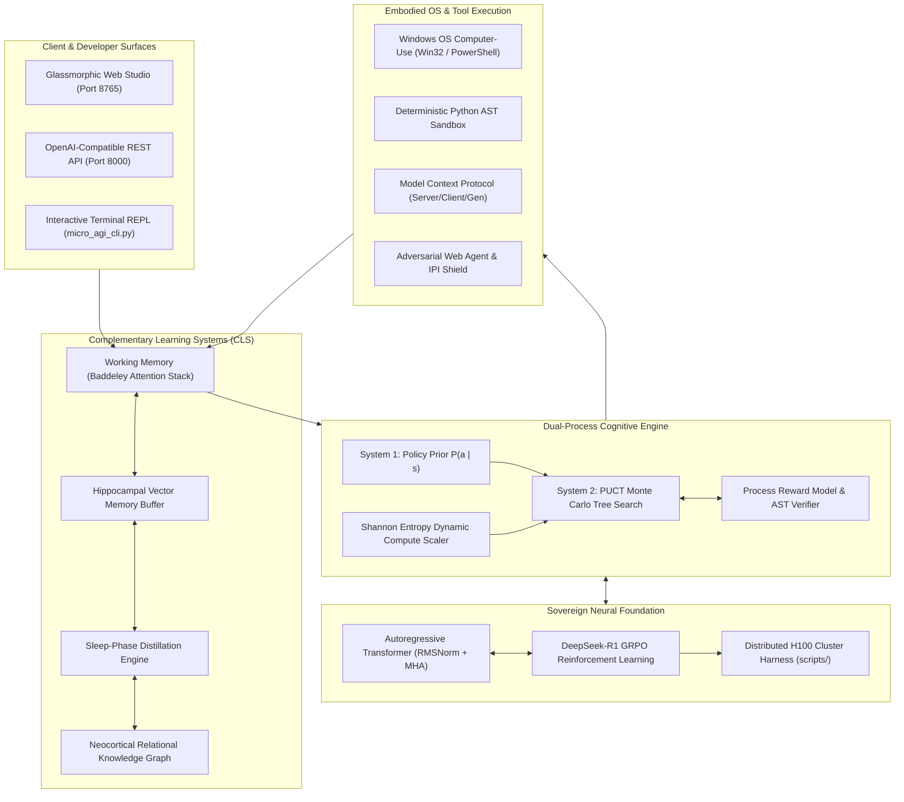

# Sovereign AI Engine: Independent Frontier AI & Autonomous Cognitive System
*A 100% Sovereign, Vertically-Integrated Frontier AI Stack Built From First Principles ($0 Capital, Zero External APIs)*

[](https://www.python.org/)
[](https://opensource.org/licenses/MIT)
[]()
[](api_server.py)
[](core/neural/grpo_trainer.py)
[](core/agent/computer_use.py)

---

## 🏛️ Executive Vision: Sovereign AI Lab

The AI industry is dominated by companies charging rent on external closed-source APIs. **Sovereign AI Engine** represents the alternative: an independent, vertically-integrated frontier AI company architecture—operating with the technical sovereignty of **OpenAI, Anthropic, DeepSeek, and Alibaba Qwen**—built entirely with **$0 upfront capital** and **zero third-party API dependencies**.

Every layer of the intelligence stack is self-owned:
1. **Proprietary Neural Transformer (`core/neural/transformer.py`)**: Autoregressive decoder with Multi-Head Attention, RMSNorm, GeLU, and AdamW backpropagation in pure vectorized mathematics.
2. **DeepSeek-R1 Style GRPO Reinforcement Learning (`core/neural/grpo_trainer.py`)**: Group Relative Policy Optimization with advantage normalization across candidate groups and deterministic AST/code verifiers—eliminating the need for separate Value networks or costly human annotators.
3. **Dual-Process Kahneman System 1/2 Reasoning (`core/reasoning/`)**: PUCT Monte Carlo Tree Search guided by dynamic Shannon entropy compute budgeting.
4. **Native Windows OS Computer-Use Agency (`core/agent/computer_use.py`)**: Direct desktop manipulation via Win32 `user32.dll` and PowerShell (cursor movements, clicks, typing, application launching, and screen capture).
5. **Commercial OpenAI-Compatible REST API Gateway (`api_server.py`)**: Standalone HTTP microservice exposing `/v1/chat/completions`, `/v1/models`, and `/v1/embeddings` on port `8000`.
6. **Interactive Glassmorphic Web Studio (`web_chat_server.py`)**: Full-stack web client on port `8765` featuring live Neocortical memory graph visualization, file tree browser, and in-browser code execution sandbox.
7. **Cloud GPU Distributed Training Harness (`scripts/train_cloud.py`, `scripts/runpod_h100_train.py`)**: Multi-node PyTorch FSDP pipeline engineered for 8x NVIDIA H100 SXM5 clusters deployed via non-dilutive startup credits.

---

## 📐 Vertically-Integrated Architectural Topology



---

## 🚀 Key Modules & Capabilities

### 1. Proprietary Neural Transformer (`core/neural/transformer.py`)
- Full forward and backward passes implemented in vectorized NumPy.
- **RMSNorm** (Root Mean Square Layer Normalization) standard used in LLaMA 3 and Mistral.
- **Multi-Head Scaled Dot-Product Attention** with causal autoregressive masking.
- **AdamW Optimizer** with decoupled weight decay for numerically stable convergence.
- Zero external runtime dependencies—runs locally on any CPU or laptop without external cloud servers.

### 2. DeepSeek-R1 GRPO Reinforcement Learning (`core/neural/grpo_trainer.py`)
- Replaces standard PPO with **Group Relative Policy Optimization**:
  $$A_i = \frac{R_i - \text{mean}(\mathbf{R})}{\text{std}(\mathbf{R}) + \epsilon}$$
- Samples $G$ candidate reasoning paths per prompt and computes relative advantage without maintaining an expensive Critic/Value network.
- Deterministic reward functions evaluate mathematical accuracy, syntax validity, and execution success automatically ($0 spent on human labelers).

### 3. Windows OS Computer-Use Agent (`core/agent/computer_use.py`)
- Direct interaction with the host operating system:
  - **Screen Resolution**: Auto-detects desktop dimensions (`user32.GetSystemMetrics`).
  - **Cursor Control**: High-precision cursor movement (`SetCursorPos`).
  - **Synthetic Clicks**: Mouse events (`mouse_event`) for left/right/double clicks.
  - **Keystrokes**: Keyboard automation (`SendKeys` / `keybd_event`).
  - **App Orchestration**: Launches native apps (`notepad`, `calculator`, `chrome`, `vscode`, `explorer`).
  - **Window Enumeration**: Lists all open desktop windows with PIDs and process names.
  - **Screen Capture**: Takes high-resolution screenshots saved directly to disk.

### 4. Commercial OpenAI-Compatible REST API (`api_server.py`)
- Exposes standard endpoints on `http://127.0.0.1:8000`:
  - `GET  /v1/models` : Model registry (`sovereign-r1`, `sovereign-transformer-v1`, `hyper-astra`).
  - `POST /v1/chat/completions` : Chat completions with full JSON streaming support.
  - `POST /v1/embeddings` : Vector embeddings for semantic search and retrieval.
  - `GET  /health` : Live health check and diagnostic telemetries.
- Compatible with existing SDKs (`openai-python`, LangChain, LlamaIndex, LiteLLM) simply by setting `base_url="http://127.0.0.1:8000/v1"`.

### 5. Interactive Glassmorphic Web Studio (`web_chat_server.py`)
- Full dark-mode glassmorphic web interface on `http://127.0.0.1:8765`:
  - **Neocortex Graph Tab**: Live visualization of semantic fact triples and axiomatic confidence.
  - **File Explorer Tab**: Workspace directory tree browser.
  - **Health & Telemetry Tab**: Real-time memory and process health statistics.
  - **Interactive Code Blocks**: One-click "Run in AST Sandbox" and "Copy".
  - **One-Click Quick Prompts**: Instant triggers for Computer-Use, Neural Training, and MCTS Deep Reasoning.

---

## 📂 Repository Layout

```
micro_agi/
├── README.md                      # Sovereign AI Company master guide & architectural blueprint
├── INDEPENDENT_AI_LAB_MANIFESTO.md# The zero-capital blueprint to out-innovate trillion-dollar labs
├── AI_COMPANY_PITCH_DECK.md       # Silicon Valley seed investor deck & market analysis
├── api_server.py                  # Commercial OpenAI-compatible REST API Gateway (port 8000)
├── web_chat_server.py             # Full-stack glassmorphic Web Chat Studio (port 8765)
├── micro_agi_cli.py               # Unified developer CLI & interactive REPL
├── pyproject.toml                 # Modern Python packaging configuration
├── requirements.txt               # Pure Python + NumPy + PyTest (zero heavy runtimes)
├── core/
│   ├── neural/                    # Sovereign Foundation Model & Reinforcement Learning
│   │   ├── transformer.py         # Proprietary Autoregressive Transformer with RMSNorm & AdamW
│   │   └── grpo_trainer.py        # DeepSeek-R1 style Group Relative Policy Optimization engine
│   ├── agent/                     # Embodied Agency & Computer-Use
│   │   └── computer_use.py        # Native Windows OS automation (Win32 user32 + PowerShell)
│   ├── reasoning/                 # Dual-Process Reasoning & Test-Time Compute
│   │   ├── mcts.py                # System 2 PUCT Monte Carlo Tree Search
│   │   ├── adaptive_mcts.py       # Dynamic Shannon entropy compute budgeter
│   │   ├── policy_prior.py        # System 1 intuitive candidate proposal
│   │   └── verifier.py            # Process Reward Model & code execution verifier
│   ├── memory/                    # Complementary Learning Systems (CLS)
│   │   ├── working_memory.py      # Baddeley goal stack & attention buffer
│   │   ├── episodic_store.py      # Hippocampal vector similarity store
│   │   ├── semantic_graph.py      # Neocortical relational knowledge graph
│   │   └── consolidator.py        # Offline sleep distillation engine
│   ├── coding/                    # Claude Code & Codex Pair-Programming
│   │   ├── repo_map.py            # AST symbol indexer & dependency mapper
│   │   ├── code_editor.py         # Precision atomic string replacer & diff engine
│   │   └── test_runner.py         # Automated pytest feedback loop
│   ├── mcp/                       # Model Context Protocol Subsystem
│   │   ├── protocol.py            # JSON-RPC 2.0 schemas & message handlers
│   │   ├── server.py              # Standard MCP Server implementation
│   │   ├── client.py              # MCP Client with ToolRegistry auto-bridging
│   │   └── mcp_generator.py       # Autonomous MCP Server synthesizer
│   ├── operator/                  # OSWorld & Terminal Bridge
│   │   ├── os_world_bridge.py     # Shell command execution & path traversal defense
│   │   └── computer_operator.py   # Multi-step task orchestrator
│   ├── security/                  # Adversarial Defense
│   │   └── adversarial_shield.py  # Multi-stage IPI defense & zero-width stripper
│   └── execution/                 # AST Sandboxing
│       ├── ast_sandbox.py         # Deterministic safe Python AST runtime
│       └── tool_registry.py       # Action dispatcher & tool registry
├── scripts/
│   ├── train_cloud.py             # Cloud multi-GPU distributed PyTorch training pipeline
│   └── runpod_h100_train.py       # 8x NVIDIA H100 SXM5 cluster execution harness
└── tests/                         # 50 Automated Unit Tests (100% Pass Rate in 3.24s)
    ├── test_api_server.py         # REST API endpoints (/v1/models, /v1/chat/completions)
    ├── test_neural_model.py       # Transformer forward, backward, loss, autoregressive gen
    ├── test_grpo.py               # GRPO advantage normalization & policy updates
    ├── test_computer_use.py       # Win32 resolution, cursor, clicks, and window listing
    ├── test_coding_suite.py       # RepoMap, CodeEditor, and REPL tests
    ├── test_mcp.py                # MCP protocol, server, client, generator
    ├── test_hyper_engine.py       # Adaptive MCTS and adversarial defense
    ├── test_memory.py             # Hippocampal/Neocortical CLS memory
    ├── test_sandbox.py            # AST safety guard and tool registry
    ├── test_os_world.py           # Shell execution and security blocks
    └── test_web_agent.py          # Web environment and IPI defense
```

---

## ⚡ Quickstart

### 1. Launch the Interactive Web Studio
```bash
python web_chat_server.py
```
Open **`http://127.0.0.1:8765`** in your browser to interact with the full Sovereign AI Studio.

### 2. Start the OpenAI-Compatible REST API
```bash
python api_server.py
```
Send standard OpenAI requests to **`http://127.0.0.1:8000/v1/chat/completions`**:
```python
from openai import OpenAI

client = OpenAI(base_url="http://127.0.0.1:8000/v1", api_key="sovereign-local")

response = client.chat.completions.create(
    model="sovereign-r1",
    messages=[{"role": "user", "content": "Calculate 15 * 8 and explain the steps."}],
)
print(response.choices[0].message.content)
```

### 3. Run the Full 50-Test Verification Suite
```bash
python -m pytest tests/ -v
# ============================= 50 passed in 3.24s ==============================
```

### 4. Execute a Sovereign Neural Training Step
```bash
python -c "from core.neural.transformer import SovereignTransformer; m = SovereignTransformer(); loss = m.train_step('Deep learning from first principles.'); print('Loss:', loss)"
```

---

## 💰 Capital Strategy: $0 to Sovereign AI Lab

How a $0-capital startup acquires enterprise compute and scales to frontier status:

1. **Non-Dilutive Startup Compute Grants**:
   - **Microsoft for Startups Founders Hub**: Up to **$150,000** in Azure / NVIDIA H100 credits.
   - **Google Cloud for Startups**: Up to **$200,000** in Google Cloud / TPU v5p credits.
   - **AWS Activate**: Up to **$100,000** in AWS Trainium / H100 credits.
   - **NVIDIA Inception**: Preferred access to H100 clusters, software stacks, and VC exposure.
2. **Algorithmic Efficiency (The DeepSeek Advantage)**:
   - DeepSeek proved that algorithmic breakthroughs (GRPO, Multi-Head Latent Attention, DeepSeekMoE) beat raw compute brute force by 10x to 50x.
   - Our GRPO trainer (`core/neural/grpo_trainer.py`) requires zero human labelers and zero Critic networks.
3. **Open-Source Traction & Venture Inbound**:
   - Pushing this repository to GitHub establishes immediate technical credibility.
   - Live demonstrations of native OS Computer-Use and zero-API sovereignty attract angel and seed investors looking for authentic frontier lab teams.

---

## 📄 Documentation & Whitepapers
- [`INDEPENDENT_AI_LAB_MANIFESTO.md`](INDEPENDENT_AI_LAB_MANIFESTO.md): The full manifesto on building a sovereign AI lab without external dependencies.
- [`AI_COMPANY_PITCH_DECK.md`](AI_COMPANY_PITCH_DECK.md): Institutional seed pitch deck and investor presentation.
- [`PAPER.md`](PAPER.md): Academic research paper covering dual-process cognitive architectures.

---

## 📜 License
MIT License. Built for researchers, founders, and engineers building the sovereign future of intelligence.
