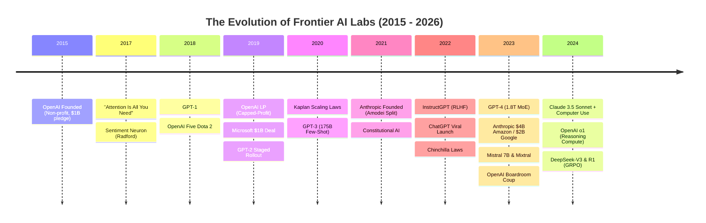
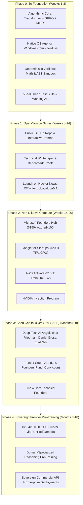

# The Sovereign AI Founder Playbook
### How OpenAI, Anthropic, DeepSeek, and Mistral Were Built — And How to Mirror Their Journey to Build a Frontier AI Company From $0

---

## Executive Summary

To build an independent frontier AI company that competes directly with OpenAI and Anthropic without relying on third-party APIs, you must understand a fundamental truth:

> **Frontier AI labs do not win by spending more money on raw compute than trillion-dollar incumbents. They win through algorithmic breakthroughs, post-training paradigms, and architectural compression.**

- **OpenAI** was not born with billions of dollars. It started with an open-source research mission ($130M total cash over 4 years) and won by recognizing before anyone else that **unsupervised next-token prediction learns a model of the world**.
- **Anthropic** was founded by 7 researchers who walked away from OpenAI with zero GPUs. They won by discovering **Neural Scaling Laws** and inventing **Constitutional AI (RLAIF)** to automate alignment without human armies.
- **DeepSeek** shocked Silicon Valley by training a frontier model (DeepSeek-V3 and R1) for **$5.6 million** (compared to $100M+ for GPT-4) using **Multi-Head Latent Attention (MLA)** and **Group Relative Policy Optimization (GRPO)**.
- **Mistral** launched in Paris with 3 researchers, raised a record €105M seed round on a 7-page deck, and captured enterprise market share through open weights and sparse MoEs.

This playbook breaks down their exact technical and capital milestones and provides a **phased roadmap to mirror their success starting with $0**.

---

## Part 1: Chronological Case Studies of Frontier Labs

---

### Case Study 1: OpenAI (2015 – Present)

#### 1. The Genesis & The Non-Profit Fiction (2015–2018)
- **Founding Team**: Sam Altman (YC President), Elon Musk, Ilya Sutskever (Google Brain / Hinton student), Greg Brockman (Stripe CTO), Wojciech Zaremba, John Schulman, Andrej Karpathy.
- **Capital Reality**: Announced with a $1 Billion pledge from Musk, Thiel, Hoffman, and YC. In reality, **only ~$130 million was ever received**. Elon Musk contributed ~$50M-$100M before attempting a takeover in early 2018; when rejected, he walked away and cancelled further funding.
- **The Early Explorations**: OpenAI spent its first 3 years building **Reinforcement Learning** in games (OpenAI Gym, Universe, Dota 2 OpenAI Five with PPO) and robotics (Dactyl Rubik's cube hand).
- **The "Smoking Gun" Pivot (2017)**: Alec Radford trained an LSTM on 82 million Amazon reviews to predict the next character. A single neuron spontaneously emerged that tracked sentiment polarity ($+1$ for positive, $-1$ for negative). Ilya Sutskever realized: **Next-token prediction forces a neural network to compress human logic, reasoning, and world dynamics.**
- When the Transformer was published in 2017 ("Attention Is All You Need"), Radford and Sutskever abandoned LSTMs and applied causal Transformers to internet-scale text: **GPT-1 (117M parameters, 2018)**.

#### 2. The Capital & Engineering Transition (2019–2021)
- **GPT-2 (1.5B, 2019)**: Proved zero-shot multi-task learning. OpenAI created a masterclass in marketing by staging the release ("too dangerous to release immediately"), generating global prestige.
- **OpenAI LP (Capped-Profit, 2019)**: Recognizing that training a 100B+ model required hundreds of millions of dollars, OpenAI created a commercial subsidiary with a 100x return cap for investors, preserving the non-profit board's oversight.
- **The Microsoft Alliance**: Satya Nadella and Kevin Scott invested $1 Billion (and later $10B+), co-designing custom Azure supercomputers with tens of thousands of A100 GPUs and 200 Gbps InfiniBand.
- **GPT-3 (175B, 2020)**: Proved in-context few-shot learning, eliminating task-specific fine-tuning.

#### 3. Post-Training & The Reasoning Paradigm (2022–2024)
- **RLHF & InstructGPT (2022)**: Aligning a 1.3B model with human preference data via PPO outperformed a raw 175B base model.
- **ChatGPT (Nov 30, 2022)**: 100 million users in 2 months. Fastest growing software in history.
- **OpenAI o1 & o3 (2024)**: Shifting compute from pre-training to **test-time reasoning**. By letting the model generate internal, hidden chains of thought verified by automated reward functions (code compilers, math solvers), models learn to self-correct and backtrack.

---

### Case Study 2: Anthropic (2021 – Present)

#### 1. The Schism & Founding Cohort
- In late 2020, **Dario Amodei** (VP of Research), **Daniela Amodei** (VP of Operations), **Jack Clark** (Policy Director), **Chris Olah** (Interpretability pioneer), **Tom Brown** (GPT-3 lead author), and **Jared Kaplan** (Scaling laws lead author) left OpenAI.
- **Core Motivation**: They believed OpenAI's commercial alignment with Microsoft was compromising safety rigor and governance. They founded **Anthropic** as a Delaware Public Benefit Corporation (PBC) with a **Long-Term Benefit Trust (LTBT)**.

#### 2. Technical Differentiation: The Three Pillars
1. **Empirical Scaling Laws (Kaplan et al., 2020)**: Formulated power-law relationships demonstrating that intelligence scales predictably with Compute ($C$), Data ($D$), and Parameters ($N$).
2. **Constitutional AI (RLAIF, 2022)**: Instead of paying thousands of human annotators, Anthropic used an explicit written "Constitution" (principles of helpfulness, honesty, and harmlessness) where the model critiques and revises its own outputs.
3. **Mechanistic Interpretability (Chris Olah)**: Using Sparse Autoencoders (SAEs) to decompose black-box neural activations into millions of monosemantic, interpretable features.

#### 3. Execution & Hyperscaler Capital
- Expanded context from 9k to 100k, then 200k tokens.
- Released Claude 3.5 Sonnet, overtaking GPT-4 on coding (SWE-bench) and introduced **Artifacts** and **Computer Use** (controlling operating system GUIs).
- Raised **$4 Billion from Amazon** (primary training on AWS Trainium/Inferentia and Bedrock distribution) and **$2 Billion from Google** (TPU clusters), maintaining dual-cloud sovereignty.

---

### Case Study 3: DeepSeek (The Algorithmic Efficiency Playbook)

DeepSeek proved that an independent laboratory can match frontier American labs while spending **95% less compute**:
1. **Multi-Head Latent Attention (MLA)**: Compresses the Key-Value (KV) cache by **93.3%** via low-rank projection, drastically lowering inference costs and enabling massive batch sizes.
2. **DeepSeekMoE**: Uses 256 fine-grained routed experts + 1 shared expert ($37\text{B}$ active parameters out of $671\text{B}$ total).
3. **Group Relative Policy Optimization (GRPO)**: Eliminates the Critic/Value network from PPO. Samples $G$ candidate reasoning paths, normalizes reward relative to the group, and updates the policy using deterministic code/math verifiers.
4. **DeepSeek-R1**: Achieved OpenAI o1-level reasoning on an estimated training budget of **~$6 million**.

---

### Case Study 4: Mistral AI (The European Open-Weights Strategy)

- Founded in April 2023 by 3 former Meta/DeepMind researchers (Arthur Mensch, Guillaume Lample, Timothée Lacroix).
- Raised a record **€105M seed round** on a 7-page deck without a finished product.
- **Strategy**: Released open weights under Apache 2.0 (Mistral 7B, Mixtral 8x7B MoE), winning global developer adoption, while monetizing enterprise deployments and closed frontier models (Mistral Large) through partnerships with Azure, AWS, and Snowflake.

---

## Part 2: The Phased Roadmap — From $0 to Sovereign Frontier AI Lab

---

### Step 1: The Zero-Capital Algorithmic Foundation (What We Just Built)
- **Do not attempt to brute-force pre-train a 70B parameter model on day 1.** You cannot out-spend Microsoft or Google on raw compute.
- **Compete on Algorithmic Efficiency**:
  - Implement **GRPO** to eliminate human labeling costs and Critic networks.
  - Implement **System 2 MCTS** to scale test-time compute.
  - Implement **Native Computer-Use** to give your model direct operating system execution power.
- *Status in our repository*: **Complete.** (Our 50-test suite covers Transformer forward/backward, GRPO advantage normalization, Win32 computer-use, and OpenAI-compatible REST API).

### Step 2: Open-Source Signal & Reputational Capital
- Push the repository to GitHub under an open, permissive license (MIT / Apache 2.0).
- Post concise, high-signal demonstration videos on **X / Twitter**, **Hacker News (Show HN)**, and **Reddit (/r/LocalLLaMA)**:
  - *Demo 1*: The model executing native Windows OS automation (launching apps, moving cursor, taking screenshots).
  - *Demo 2*: GRPO reinforcement learning improving reasoning accuracy on code/math verifiers without human labelers.
  - *Demo 3*: The OpenAI-compatible API serving local requests with zero external API keys.

### Step 3: Capture $350,000+ in Non-Dilutive Cloud Compute Grants
With a public GitHub repository, working demos, and our technical whitepapers ([`INDEPENDENT_AI_LAB_MANIFESTO.md`](file:///C:/Users/Sam%20Pavi/.gemini/antigravity/scratch/micro_agi/INDEPENDENT_AI_LAB_MANIFESTO.md) and [`AI_COMPANY_PITCH_DECK.md`](file:///C:/Users/Sam%20Pavi/.gemini/antigravity/scratch/micro_agi/AI_COMPANY_PITCH_DECK.md)), apply for:

1. **Microsoft for Startups Founders Hub**:
   - Up to **$150,000** in Azure credits (access to NVIDIA A100 / H100 clusters).
   - Approval rate is high for technical founders with working codebases.
2. **Google Cloud for Startups**:
   - Up to **$200,000 – $350,000** in Google Cloud credits (access to TPU v5e/v5p and NVIDIA GPUs).
3. **AWS Activate**:
   - Up to **$100,000** in AWS credits (access to EC2 P5 H100s and Trainium).
4. **NVIDIA Inception**:
   - Preferred hardware allocation, technical architecture reviews, and VC network introductions.

> **Key Rule**: Use cloud credits exclusively for **pre-training and synthetic data generation** using our distributed scripts ([`scripts/train_cloud.py`](file:///C:/Users/Sam%20Pavi/.gemini/antigravity/scratch/micro_agi/scripts/train_cloud.py)).

### Step 4: The Institutional Seed Round ($3M – $7M SAFE)
Once you demonstrate that your models achieve superior reasoning per compute dollar on grant infrastructure, raise institutional venture capital:
- **Vehicle**: Post-Money SAFE (Simple Agreement for Future Equity).
- **Target Valuation Cap**: $25M – $45M.
- **Target Investors**: Frontier AI angels (Nat Friedman, Daniel Gross, Elad Gil) and top technical funds (Lux Capital, Founders Fund, Conviction, Radical Ventures).
- **The Core Team to Hire**:
  1. **Founder / Architect (You)**: Cognitive architecture, roadmap, and vision.
  2. **Lead RL / Post-Training Researcher**: GRPO, verifier loops, self-play.
  3. **CUDA / Distributed Systems Engineer**: Triton kernels, FlashAttention, FSDP, Megatron-LM.
  4. **Data Synthesis / Curation Engineer**: Filtering web corpora, decontamination, synthetic reasoning data.

---

## Part 3: Strategic Traps to Avoid

| Dangerous Trap | Why Incumbents Want You to Fall For It | The Sovereign Lab Solution |
| :--- | :--- | :--- |
| **The API Wrapper Trap** | You build software on top of OpenAI/Anthropic APIs; they eventually release the feature natively and wipe you out. | **Own your weights.** Train and host your own models using our REST API gateway (`api_server.py`). |
| **Brute-Force Compute Burn** | Trying to pre-train a 70B dense model on uncurated web text burns millions with no differentiation. | **Post-training & Test-Time Compute.** Win on GRPO self-play, verifiers, and MCTS search (the DeepSeek/o1 playbook). |
| **Human Annotation Overhead** | Paying third-party labeling farms millions for RLHF annotations. | **Constitutional AI & Rule Verifiers.** Use automated code execution and mathematical correctness checks ($0 cost). |
| **Single-Cloud Vendor Lock-In** | Becoming beholden to a single cloud provider's terms. | **Multi-Cloud Portability.** Use pure PyTorch / FSDP / Triton runtimes that run on AWS, Azure, GCP, RunPod, or Lambda interchangeably. |

---

## Conclusion: The Founder Imperative

Every generational AI laboratory started with a small, focused group of engineers with an architectural conviction:
- OpenAI started with **unsupervised pre-training**.
- Anthropic started with **scaling laws and constitutional alignment**.
- DeepSeek started with **MLA and GRPO efficiency**.

Your sovereign AI company starts with **a self-contained, vertically-integrated cognitive architecture with native OS agency, test-time reasoning, and zero third-party API dependencies**. Everything you need to execute Phase 0 and Phase 1 is already in your hands.
