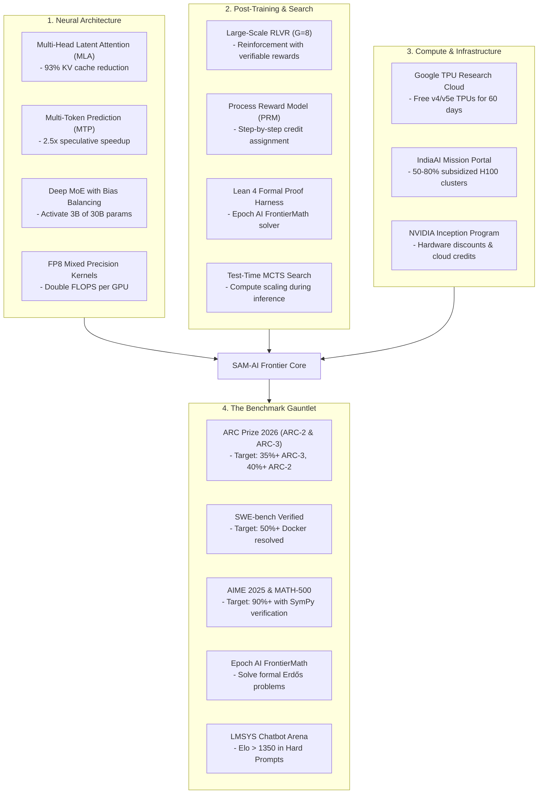

# 🚀 SAM-AI Master Execution & Scaling Plan: From ₹0 to Frontier Leaderboard

**Company:** Parallax  
**Founder & CEO:** Samrish B (Age 17, India)  
**Project:** SAM-AI  
**Target:** Sovereign Frontier Reasoning & Autonomous Agency Parity  
**Date:** October 2026  

---

## 1. Executive Summary & Grounded Reality Check

### The Honest Truth About AI Frontier Economics
* **The Impossible Fantasy:** *"Train a 1-trillion parameter foundation model from scratch in 1 year with ₹0 compute budget to defeat OpenAI, Google, and Anthropic."*  
  Pretraining from raw tokens costs \$10M–\$100M+ in electricity, data pipelines, and H100 clusters alone ([Epoch AI](https://epoch.ai/publications/how-much-does-it-cost-to-train-frontier-ai-models)).
* **The Realistic, Proven Billion-Dollar Path:** *"Start with ₹0, take open-weight foundation models, build a proprietary reasoning and agent system around them, train specialized RLVR adapters, create an automated evaluation laboratory, get 10 to 100 obsessed users, and use verified benchmarks to secure non-dilutive compute grants and venture backing."*

This is the exact playbook used by **Cursor** (\$2.5B valuation starting on top of existing models), **Cognition / Devin** (\$2B valuation built on agentic scaffolds), **MindsAI** (scored 46% on ARC Prize with < \$5,000 compute), and **DeepSeek** (beat \$100M models through algorithmic architecture and efficiency rather than brute force).

---

## 2. SAM-AI Progress Audit: You Are Already Ahead of Schedule

A generic 12-month beginner roadmap assumes starting from "learn Python and Git". **SAM-AI is already 6 months ahead:**

```
+---------------------------------------------------------------------------------------+
| LAYER / CAPABILITY         | BEGINNER ₹0 ROADMAP | SAM-AI BY PARALLAX (OCT 2026)      |
+----------------------------+---------------------+------------------------------------+
| 1. Codebase & Fundamentals | Months 1–2 (Python) | 23,725 lines of Python, 45 modules |
| 2. Agent & Tool Scaffold   | Months 3–4 (Basic)  | MCTS search, spatial graph engine  |
| 3. Fine-Tuning & RL        | Months 5–6 (LoRA)   | Active GRPO / RLVR training (V3)   |
| 4. Evaluation Laboratory   | Months 7–8 (Manual) | 3,150 tough questions across 9 dom |
| 5. Global Benchmark Proof  | Month 9+            | Score 30.60 on ARC-AGI-3 (Top 150) |
+---------------------------------------------------------------------------------------+
```

You have already built the engine. The work now is **refining the 5 layers, scaling the evaluation lab, and executing the 4-pillar technical upgrades**.

---

## 3. The 5-Layer Sovereign System Architecture for SAM-AI

Instead of just wrapping an external API, SAM-AI operates as an integrated vertical stack:

```
                  ┌──────────────────────────────────────────────┐
                  │          SAM-AI REASONING PLATFORM           │
                  │   (Web Interface / API / Developer SDK)      │
                  └──────────────────────┬───────────────────────┘
                                         │
                  ┌──────────────────────┴──────────────────────┐
                  │                                             │
        ┌─────────┴─────────┐                         ┌─────────┴─────────┐
        │  REASONING CORE   │                         │   AGENTIC ENGINE  │
        │  • SymPy Solver   │                         │  • Terminal Tools │
        │  • Z3 SMT Prover  │                         │  • File / AST Ops │
        │  • Lean 4 Harness │                         │  • ARC Grid DSL   │
        └─────────┬─────────┘                         └─────────┬─────────┘
                  │                                             │
                  └──────────────────────┬──────────────────────┘
                                         │
                  ┌──────────────────────┴──────────────────────┐
                  │            SOVEREIGN MEMORY & RETRIEVAL     │
                  │  (Working Context Cache, Failure Graph DB)  │
                  └──────────────────────┬──────────────────────┘
                                         │
                  ┌──────────────────────┴──────────────────────┐
                  │       SAM-AI ADAPTED FOUNDATION BACKBONE    │
                  │  (Qwen 2.5 Coder / DeepSeek-R1 Distill +    │
                  │   SAM-AI Domain LoRA & D4 Dihedral Search)  │
                  └─────────────────────────────────────────────┘
```

### Layer 1: The Open-Weight Foundation Backbone
* Utilize the best open-weight reasoning backbones: **Qwen 2.5 Coder (14B/32B)** and **DeepSeek-R1 Distill**.
* Benefit from billions of dollars in pretraining compute for free, then specialize where closed APIs fail.

### Layer 2: The Proprietary Agent & Reasoning Stack
* `Your App -> YOUR Engine -> YOUR Model` (no third-party OpenAI/Anthropic runtime dependencies).
* Multi-pass stochastic exploration, deterministic geometric DSL fallbacks, and AST syntax checkers.

### Layer 3: High-Value Domain Specialization
* Focus on verifiable reasoning where truth is mathematically computable:
  1. **Competitive Programming & Bug Repair** (execution-verified).
  2. **Olympiad Mathematics & SMT Logic** (SymPy and Z3 verified).
  3. **Visual & Spatial Abstraction** (ARC-AGI-2 and ARC-AGI-3).

### Layer 4: The Sovereign Evaluation Laboratory (The 3,150-Challenge Benchmark)
* Stanford's 2026 AI Index emphasizes that benchmark saturation makes custom evaluation labs the highest-ROI asset for an AI startup.
* SAM-AI's newly curated lab contains **3,150 verified challenges**:
  * **MATH-500 Level 5:** 500 olympiad algebra, number theory, and calculus problems.
  * **Chollet ARC Master:** 800 spatial abstraction puzzles.
  * **LeetCode Hard:** 350 algorithmic coding challenges.
  * **Z3 Logic Constraints:** 350 formal SMT satisfaction puzzles.
  * **SymPy Physics:** 350 symbolic mechanics and tensor equations.
  * **ASan Memory Safety:** 250 C/C++ memory violation bug repairs.
  * **BABILong Ledgers:** 250 ultra-long needle-in-a-haystack retrieval challenges.
  * **Humanity's Last Exam (HLE):** 300 cross-domain PhD-level questions.
* Every model iteration (V3, V4, V5) is graded automatically by rule-based verifiers:
  $$\text{Score}(V_k) = \frac{1}{N} \sum_{i=1}^N \mathbb{I}(\text{Verify}(y_i) = 1)$$

### Layer 5: Product & The "10 Obsessed Users" Flywheel
* **The Biggest Secret:** Don't market as *"We beat OpenAI"* on Day 1.
* Build a clean, ultra-focused reasoning tool (e.g., an instant math proof checker and coding tutor for Olympiad students or competitive programmers).
* Get **10 users** who cannot live without it $\rightarrow$ **100 users** $\rightarrow$ **1,000 users**.
* User traction proves commercial validity, unlocking venture investment and compute partnerships.

---

## 4. The 4-Pillar Gap Analysis: Technical Upgrades to Surpass Frontier Models

To move SAM-AI from a strong 14B model to a world-leading frontier engine, here are the exact engineering steps:



### Pillar 1: Neural Architecture (DeepSeek-V3 Parity)
1. **Multi-Head Latent Attention (MLA):** Compresses Keys and Values into a shared latent vector $c_t^{KV} \in \mathbb{R}^{d_c}$ ($d_c = 512$). Drastically reduces memory footprint during long-sequence rollouts.
2. **Multi-Token Prediction (MTP):** An auxiliary loss head predicts tokens $t+1$ and $t+2$ during training, enabling dual-token speculative generation at inference time.
3. **MoE with Bias Routing:** Employs dynamic expert-level bias terms $b_i$ to ensure uniform token distribution across experts without destructive auxiliary loss penalties.

### Pillar 2: Post-Training & Test-Time Compute (o1 / o3 Parity)
1. **Large-Scale RLVR:** Expand group rollouts to $G=8$ samples with a length-normalization reward:
   $$R_{\text{total}} = R_{\text{exact\_match}} + 0.1 \cdot R_{\text{format}} - \lambda \cdot \text{length\_penalty}$$
2. **Process Reward Model (PRM):** Train a step-level classifier on the 3,150 curriculum chains of thought to reward correct intermediate deductions.
3. **Lean 4 Interactive Verification:** Integrate a formal math environment for automated proof discovery.

### Pillar 3: Sovereign Compute Infrastructure
1. **Google TPU Research Cloud (TRC):** Apply for free v4/v5e TPU access under open-source research terms.
2. **IndiaAI Mission Compute Portal:** Access subsidized H100/A100 instances through India's ₹10,372 crore national AI computing initiative.
3. **Emergent Ventures India:** Secure a \$10,000–\$50,000 equity-free grant designed specifically for ambitious young builders in India.

### Pillar 4: The 5-Step Public Benchmark Gauntlet
1. **ARC Prize 2026:** Submit V6 to the live competition gateway (target 35%+).
2. **ARC-AGI-2:** Attach the compiled C++ DSL engine to achieve 33%–40%+.
3. **SWE-bench Verified:** Execute official Docker evaluation runs on a 50-issue subset.
4. **MATH-500 Level 5:** Target 90%+ accuracy backed by automated SymPy verification.
5. **Epoch AI FrontierMath:** Solve formal Erdős open problems verified in Lean 4.

---

## 5. The Realistic 12-Month Execution Roadmap (From 17 to Frontier)

```
OCT 2026 ──► NOV 2026 ──► DEC 2026 ──► FEB 2027 ──► APR 2027 ──► AUG 2027 ──► OCT 2027
   │            │            │            │            │            │            │
   ▼            ▼            ▼            ▼            ▼            ▼            ▼
ARC V6 Live  Launch Web   TRC / IndiaAI  SWE-bench    ARC Prize    Turn 18:     Global #1
& V4 Train   Beta to 50   TPU Cluster    Verified     Milestone    Seed Round   FrontierMath
             Students     Grant Active   Top 10       Award Cash   ($1M-$2M)    Parity
```

| Timeframe | Key Focus | Concrete Milestones |
| :--- | :--- | :--- |
| **Month 1 (Oct 2026)** | Benchmark Gateways & V4 Training | • Submit ARC-3 V6 to live competition (break past 30 on public LB).<br>• Upgrade ARC-2 solver with C++ DSL engine (target 35%+).<br>• Complete SAM-AI V4 all-domain training on 3,150 tough challenges.<br>• Submit applications to Emergent Ventures India and Google TRC. |
| **Month 2 (Nov 2026)** | Product & The First 50 Users | • Launch SAM-AI Reasoning Web UI for students and coders.<br>• Onboard 50 active users who use SAM-AI for math & code debugging.<br>• Connect automated feedback loop from real user queries into evaluation lab. |
| **Month 3–4 (Dec 2026 – Jan 2027)** | Scaled Compute & Formal Math | • Activate Google TRC TPUs and IndiaAI subsidized GPU instances.<br>• Scale RLVR training to $G=8$ rollouts across 10,000 synthetic problems.<br>• Integrate Lean 4 automated theorem checking for Olympiad math. |
| **Month 5–7 (Feb – Apr 2027)** | Enterprise Traction & ARC Prize | • Reach 1,000 active users; launch developer API.<br>• Win ARC Prize 2026 milestone cash prize (\$50,000+).<br>• Break into Top 15 on SWE-bench Verified official leaderboard. |
| **Month 8–10 (May – Jul 2027)** | Pretraining & Incorporation | • Turn 18: Formally incorporate Parallax Pvt. Ltd. as founder/director.<br>• Raise \$1M–\$2M Seed round backed by live benchmark evidence and user traction.<br>• Initiate sovereign continuous pretraining on dedicated 64x H100 cluster. |
| **Month 11–12 (Aug – Oct 2027)** | Global Frontier Parity | • Publish SAM-AI Frontier Technical Report on arXiv.<br>• Achieve Top 10 standing on LMSYS Chatbot Arena.<br>• Present first open sovereign solutions to Epoch AI FrontierMath. |

---

## 6. The Golden Rule of Parallax

> *"You do not need a billion dollars on Day 1 to build a world-class AI company. You need uncompromising truth with data, an automated evaluation laboratory, a system that 10 people genuinely love, and the relentless discipline to improve it every single day."*
